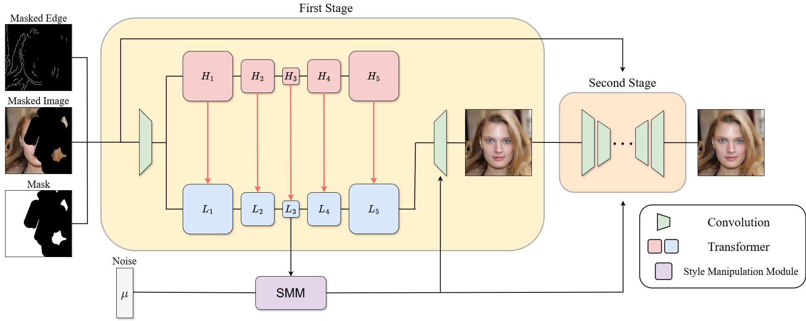

  <h1 align="center">CoReaP : Collaborative Reconstruction with assistive Priors</h1>
  

    <a>Chanhee Lee</a>
    ·
    <a>Mingu Kang</a>
  

  

    <i>Sungkyunkwan University · Department of Applied Artificial Intelligence</i> 
    <i>2024-Winter brAIn Research Program, research competition</i>
  

---
## 📄 [Paper](https://drive.google.com/file/d/1XPNHgS_uMzxiyjG3sSu1nkmrKbZIQuwL/view?usp=drive_link)

### 🖼️ Model Overview

---

## 📝 Abstract

Image inpainting aims to restore missing regions in images by generating semantically plausible and visually coherent content. A key challenge in this task is effectively leveraging unmasked regions to guide the reconstruction process. While recent advancements have primarily focused on user-guided content generation, we propose a novel approach that fundamentally enhances inpainting capability. Specifically, we introduce **CoReaP** : Collaborative Reconstruction with Assistive Priors, a two-path learning framework that separately processes high-frequency and low-frequency features to achieve more structured and detailed reconstruction. High-frequency features act as priors to guide the low-frequency path, while the low-frequency outputs further refine the inpainting process. To improve feature aggregation and receptive field expansion, we integrate deformable convolution into the transformer-based tokenization process. Our method, \textbf{CoReaP}, introduces an innovative two-path architecture where the high-frequency path serves as assistive priors, enhancing the low-frequency path’s ability to reconstruct complex structures and fine details. This synergistic interaction offers new insights for related tasks that require the integration of multi-frequency information for more coherent and visually plausible outcomes.

---

## 🚧 Experiment Not Conducted  
Although the model architecture is implemented, **full-scale experiments have not been conducted due to limited computational resources**.  
This repository currently focuses on the model structure and core ideas; training and evaluation scripts are included for reference but not yet tested end-to-end.
